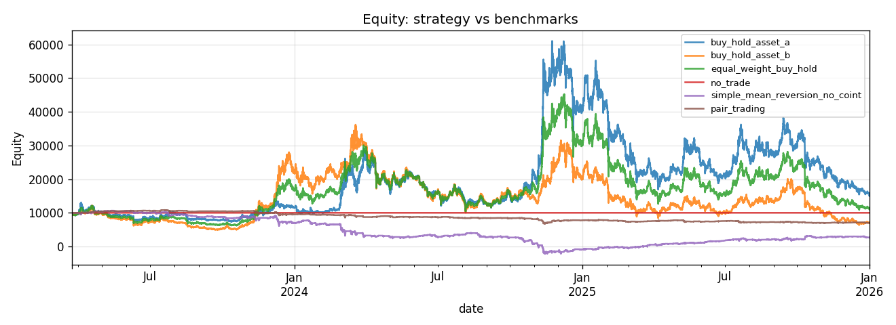
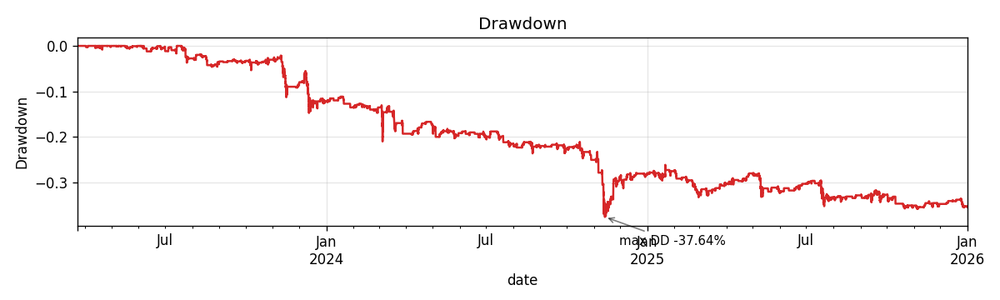
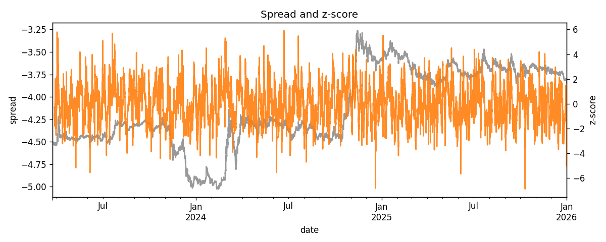
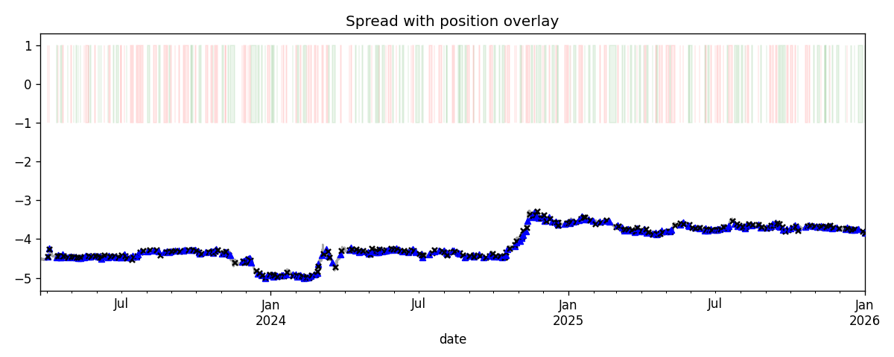
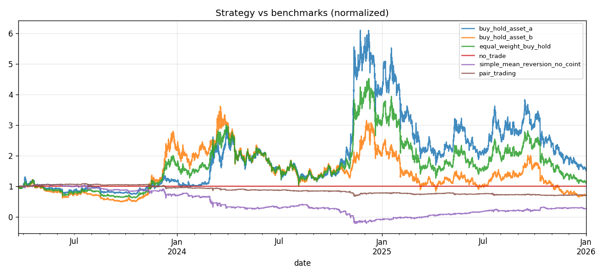

# Отчёт: парный трейдинг на основе коинтеграции и ADF

## 1. Введение

Проект реализует скрининг коинтегрированных пар на Binance USDT-M perpetual futures (таймфрейм **1h**), построение спреда и z-score, **двуногий** Python-бэктест с комиссиями и проскальзыванием, сравнение с бенчмарками и walk-forward валидацию. Дополнительно приведена стратегия **Freqtrade** как production-like приближение (торговля в основном по одной ноге с informative pair).

## 2. Цель и исследовательский вопрос

Проверить, сохраняется ли **mean reversion** лог-спреда между фьючерсами после учёта двуногих издержек и реалистичных допущений по исполнению.

## 3. Теоретическая часть

### 3.1 Парный трейдинг

Идея — заработать на отклонении спреда от долгосрочного равновесия между двумя активами, оставаясь в нейтральной по рынку конструкции (лонг/шорт ноги).

### 3.2 Корреляция против коинтеграции

Высокая корреляция не гарантирует стационарность спреда. **Коинтеграция** даёт стационарный линейный комбинированный ряд при нестационарных ценах.

### 3.3 Тест Engle–Granger

В коде: `statsmodels.tsa.stattools.coint` на лог-ценах; малый p-value отвергает отсутствие коинтеграции (порог задаётся в `screening.coint_pvalue_max`).

### 3.4 ADF-тест

`adfuller` на спреде: низкий p-value поддерживает стационарность спреда (`screening.adf_pvalue_max`).

### 3.5 Hedge ratio

OLS: \(y = \log A\), \(x = \log B\) → \(\beta\) — доля хеджа второй ноги.

### 3.6 Spread

\(\text{spread}_t = \log P_A - \beta \log P_B\) (при динамическом \(\beta\) — rolling оценка, см. конфиг).

### 3.7 Z-score strategy

\(z_t = (\text{spread}_t - \mu_w)/\sigma_w\). Пороги входа/выхода/стопа: `strategy.entry_z`, `exit_z`, `stop_z`.

### 3.8 Half-life mean reversion

Оценка half-life по AR(1) на приращениях спреда; используется в скрининге (`half_life_min`, `half_life_max_candles`).

## 4. Данные

### 4.1 Биржа и рынок

Binance USDT-M futures (`exchange`, `trading_mode` в YAML).

### 4.2 Активы

Список в `configs/pairs_top_crypto.txt`.

### 4.3 Таймфрейм и период

`timeframe: 1h`, `timerange.start` / `timerange.end` в `configs/project_config.yaml`.

### 4.4 Комиссии и slippage

В `strategy.transaction_fee` и `strategy.slippage` (по умолчанию **0.0004** и **0.0002** на долю оборота). Эти значения используются в `run_two_leg_backtest` при расчёте издержек.

### 4.5 Предобработка данных

Лог-цены, фильтр таймера, выравнивание индексов; при необходимости автозагрузка OHLCV (`data.auto_download`).

### 4.6 Проверка наличия данных

Скрипт `scripts/check_data.py` формирует `results/data_availability.csv`.

## 5. Методология

### 5.1 Скрининг пар

`screen_pairs`: все комбинации из матрицы close, фильтры качества рядов, корреляция (log prices или log returns — `screening.use_log_returns_for_correlation`).

### 5.2 Построение spread

Модуль `spread.build_spread_and_zscore`.

### 5.3 Генерация сигналов

`generate_positions_with_reasons`: выход по mean reversion (`mean_reversion_exit`) или стопу (`stop_z_exit`).

### 5.4 Backtesting

`run_two_leg_backtest`: MTM по ногам, издержки при смене позиции, капитал и доля ноги из `risk` (`leg_capital_fraction`, `max_position_size_pct`, `initial_capital` приоритетнее `project.initial_capital`).

### 5.5 Walk-forward validation

- Режим A: одна пара, календарные окна (`scripts/run_walk_forward.py`).
- Режим B: переотбор пар на train (`scripts/run_walk_forward_screening.py`).

### 5.6 Benchmarks

См. `benchmark_comparison.csv`: `pair_trading`, `buy_hold_asset_a`, `buy_hold_asset_b`, `equal_weight_buy_hold`, `no_trade`, `simple_mean_reversion_no_coint`.

### 5.7 Метрики риска

`metrics.detailed_performance`: Sharpe, Sortino, Calmar, max drawdown, win rate и profit factor по **round-trip** сделкам при наличии `trades.csv`.

## 6. Реализация

### 6.1 Структура репозитория

См. `README.md`.

### 6.2 Python research backtester

`src/pair_trading/backtester.py`, `equity_curve.csv`, `trades.csv` (ledger с `trade_id`, `exit_reason`, …).

### 6.3 Freqtrade strategy

`user_data/strategies/PairTradingCointegrationStrategy.py`: `informative_pair`, `hedge_ratio`, z-score по rolling mean/std. **Важно:** это одноногая аппроксимация сигнала относительно полного двуногого исполнения в Python.

### 6.4 Reproducibility

Фиксированные версии зависимостей через `uv.lock`; команды в README.

## 7. Результаты

Ниже — витрина таблиц; актуальные числа подставляются после прогона CSV (см. автоматическую сводку в конце файла).

### 7.1 Проверка данных

**Table 1. Dataset summary** — см. `results/data_availability.csv`.

### 7.2 Результаты скрининга

**Table 2. Top cointegrated pairs** — сортировка по `correlation` / фильтру `selected` в `pair_screening_results.csv`.

### 7.3 Selected pairs

**Table 3. Selected pairs** — `results/selected_pairs.csv`.

### 7.4 Backtest одной пары

**Table 4. Backtest metrics** — `results/backtest_summary.csv`.

### 7.5 Сравнение с бенчмарками

**Table 5. Benchmark comparison** — `results/benchmark_comparison.csv`.

### 7.6 Walk-forward результаты

**Table 6. Walk-forward results** — `results/walk_forward_screening/walk_forward_results.csv` (режим B; при отсутствии файла — устаревший `results/walk_forward_results.csv` для режима A). Дополнительно: `walk_forward_selected_pairs.csv`, `walk_forward_equity.csv` в том же каталоге.

### 7.7 Freqtrade результаты

После `bash scripts/run_freqtrade_backtest.sh` — стандартный вывод Freqtrade; `results/freqtrade_lookahead_analysis.txt` — из `run_freqtrade_lookahead_analysis.sh` (если команда доступна).

### 7.8 Графики

### 7.9 Interpretation of Current Results

The screening stage selected two statistically plausible pairs: XRP/LTC and DOGE/AVAX. However, the trading backtest on DOGE/AVAX produced negative economic performance after costs. This demonstrates that passing cointegration and ADF filters is not sufficient for profitable trading.

Скрининг выявил две статистически подходящие пары, однако практический бэктест DOGE/AVAX оказался убыточным после учёта комиссий и проскальзывания. Это показывает, что прохождение тестов коинтеграции и ADF не является достаточным условием прибыльности стратегии.

| Pair | Total Return | Sharpe | Max Drawdown | Trades | Win Rate | Profit Factor | Fees | Capital Depleted |
| --- | ---: | ---: | ---: | ---: | ---: | ---: | ---: | --- |
| DOGE/AVAX | -30.10% | -0.861 | -37.64% | 253 | 54.15% | 0.698 | 1277.84 | False |
| XRP/LTC | +50.42% | 0.783 | -18.19% | 260 | 66.54% | 1.293 | 2826.60 | False |

### 7.10 Why Statistical Significance Did Not Translate Into Profit

1. Высокий turnover и накопленные комиссии при частых перестановках двуногой позиции.
2. Сдвиги режима рынка на крипто-фьючерсах: коинтеграция на одном окне не гарантирует стабильность \(\beta\) и спреда вне окна.
3. Half-life может быть слишком большим относительно горизонта удержания и частоты сигналов.
4. Выбросы спреда могут продолжаться за пределами stop-порога; mean reversion не обязан наступить «вовремя».
5. Долгосрочные тренды доминируют над локальным возвратом к среднему.
6. Статическая оценка hedge ratio на train не переносится безошибочно на test / live.

## 8. Обсуждение

### 8.1 Где стратегия работает

При устойчивой коинтеграции и умеренных издержках z-score mean reversion может давать положительный вклад; смотрите `test_sharpe` / `test_total_return` в walk-forward.

### 8.2 Где стратегия ломается

При смене режима рынка \(\beta\) и стационарность спреда деградируют; строгий скрининг может дать пустой `selected_pairs.csv`.

### 8.3 Влияние комиссий

Чувствительность к `transaction_fee` + `slippage` высокая при частых перестановках.

### 8.4 Стабильность коинтеграции

Сравнивайте `coint_pvalue_train` / `adf_pvalue_train` по fold в walk-forward.

## 9. Ограничения

- Модель не включает funding, ликвидации, очереди ордеров.
- Freqtrade-стратегия **не** эквивалентна синхронному двуногому хеджу в Python.

## 10. Заключение

По текущему снимку данных двуногий бэктест выбранной пары DOGE/AVAX после издержек **не демонстрирует прибыльности**; метрики и CSV нужно пересчитывать после каждого изменения кода (в т.ч. защита капитала и корректные Sharpe после depletion). Репозиторий пригоден как **воспроизводимый каркас** для проверки гипотезы mean reversion, а не как готовая стратегия.

## 11. Future Work

Мультипарный портфель, учёт funding, альтернативные тесты коинтеграции (Johansen) на подвыборках.

## 12. Disclaimer

Проект **образовательный** и **не является инвестиционной рекомендацией**. Торговля криптовалютами сопряжена с высоким риском.

<!-- AUTO_REPORT_SUMMARY -->

## Автоматически сгенерированная сводка

- **pair_screening**: `results/pair_screening_results.csv` — строк: 136, столбцов: 15.
- **selected_pairs**: `results/selected_pairs.csv` — строк: 2, столбцов: 15.
- **data_availability**: `results/data_availability.csv` — строк: 17, столбцов: 7.
- **backtest_summary**: `results/backtest_summary.csv` — строк: 1, столбцов: 23.
- **benchmark_comparison**: `results/benchmark_comparison.csv` — строк: 6, столбцов: 9.
- **trades**: `results/trades.csv` — строк: 809, столбцов: 17.
- **equity_curve**: `results/equity_curve.csv` — строк: 43825, столбцов: 8.
- **spread_zscore**: `results/spread_zscore.csv` — строк: 43825, столбцов: 3.
- **walk_forward_results**: `results/walk_forward_screening/walk_forward_results.csv` — строк: 34, столбцов: 20.
- **walk_forward_selected_pairs**: `results/walk_forward_screening/walk_forward_selected_pairs.csv` — строк: 34, столбцов: 21.
- **walk_forward_equity**: `results/walk_forward_screening/walk_forward_equity.csv` — строк: 74592, столбцов: 5.
- **multi_pair_summary**: `results/multi_pair_summary.csv` — строк: 2, столбцов: 16.
- **holdout_backtest_test**: файл отсутствует или пуст (`results/holdout/backtest_summary_test.csv`).
- **sensitivity_summary**: файл отсутствует или пуст (`results/sensitivity/sensitivity_summary.csv`).

Графики: `results/figures/` (`equity_curve.png`, `drawdown.png`, `spread_zscore.png`, и др.).
